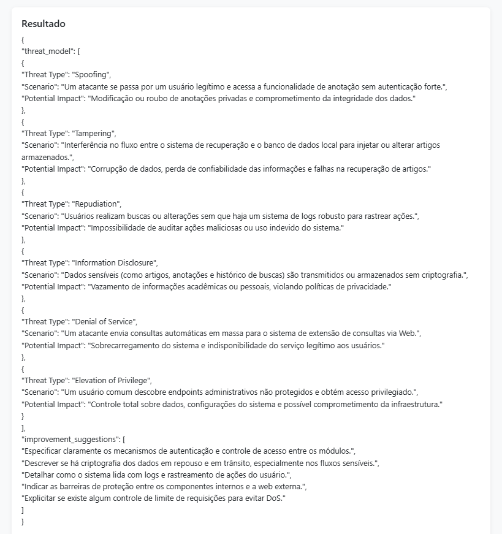
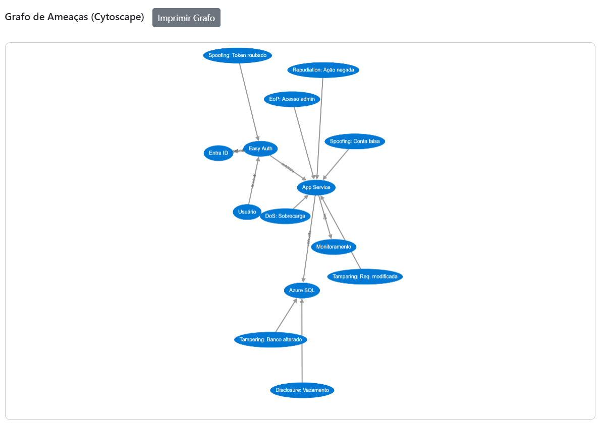

# STRIDE Threat Modeling - DIO Challenge

Este projeto faz parte do desafio prático do bootcamp da DIO, com foco na modelagem de ameaças utilizando o modelo STRIDE. O objetivo é aplicar conceitos de segurança ofensiva e defensiva em um ambiente controlado, documentando o processo técnico e explorando vulnerabilidades em aplicações Web.

## 📌 Objetivo

Criar cenários de simulação para estudo e identificação de ameaças e vulnerabilidades em aplicações, utilizando o modelo STRIDE como base.

## 🧩 Modelo STRIDE

O STRIDE é um modelo de categorização de ameaças criado pela Microsoft para auxiliar na identificação de falhas de segurança. A sigla representa:

- **S**poofing: Falsificação de identidade
- **T**ampering: Violação de integridade
- **R**epudiation: Repúdio de ações
- **I**nformation Disclosure: Divulgação de informações
- **D**enial of Service: Negação de serviço
- **E**levation of Privilege: Elevação de privilégios

## 🔧 Ambiente Utilizado

- Projeto base: [stride-demo](https://github.com/digitalinnovationone/stride-demo)
- **Linguagem:** Python 3.10+
- **Backend:** FastAPI
- **Frontend:** HTML5 + Bootstrap + Cytoscape.js
- **Bibliotecas:** OpenAI SDK, python-dotenv, uvicorn
- **Ferramentas adicionais:** Postman, Insomnia, navegador com DevTools

> ⚠️ Observação: por limitação de créditos na API, a resposta do modelo foi **simulada (mock)** para fins acadêmicos e validação da arquitetura.

## 🚨 Ameaças Simuladas (Mock)

| Categoria STRIDE       | Ameaça simulada                                   | Descrição técnica |
|------------------------|---------------------------------------------------|-------------------|
| **Spoofing**           | Acesso sem autenticação robusta                  | Atacante se passando por usuário legítimo |
| **Tampering**          | Alteração de dados entre módulos                 | Interceptação ou modificação do fluxo entre sistema e banco |
| **Repudiation**        | Ações sem rastreabilidade                        | Ausência de logs para auditoria |
| **Information Disclosure** | Exposição de dados sensíveis                  | Dados acadêmicos transmitidos sem criptografia |
| **Denial of Service**  | Requisições automáticas em massa                 | Sobrecarga via consultas externas |
| **Elevation of Privilege** | Acesso não autorizado a funções administrativas | Exploração de endpoints sem restrição de permissões |

---

## 📝 Como Executar Localmente

### 1. Clone o repositório
```bash
git clone https://github.com/romanozamoth/stride-threat-modeling-dio.git
cd stride-threat-modeling-dio/backend
```

### 2. Instale as dependências
```bash
pip install -r requirements.txt
```

### 3. Crie um arquivo `.env`
Copie o conteúdo de `.env.example` e ajuste a chave, ou deixe vazio para rodar em modo simulado.

### 4. Execute o servidor FastAPI
```bash
uvicorn main:app --reload --port 8001
```

### 5. Acesse a interface
Abra no navegador:
```
http://localhost:8001/app
```
---

## 📚 Aprendizados

- Aplicação prática do modelo STRIDE para segurança
- Criação de API com FastAPI e integração com IA simulada
- Manipulação de imagens e formulários multipart
- Visualização de relações com Cytoscape.js
- Documentação técnica em segurança da informação

---

## 📸 Evidências e Testes

- Teste realizado com a seguinte imagem de arquitetura:


- Resposta retornada via mock:



- Grafo gerado com Cytoscape.js:




## ✍️ Autor

**Thomaz Romano**  
[LinkedIn](https://www.linkedin.com/in/thomaz-romano)

🎯 Projeto desenvolvido como parte do desafio do Bootcamp DIO — Criando um Agente para Detecção de Vulnerabilidades em Arquiteturas.